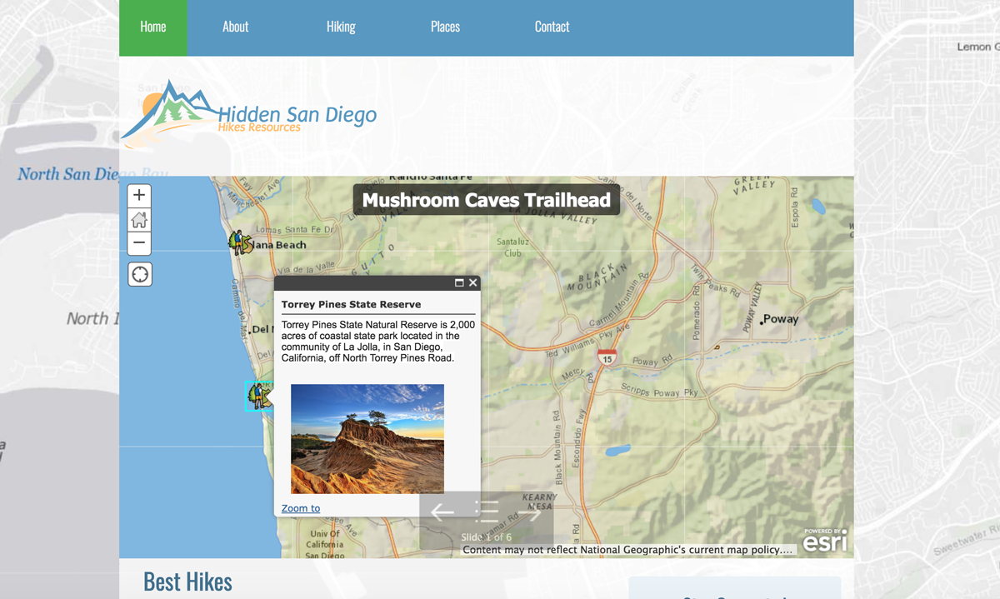

# JustHikes
JustHikes is a student project using ArcGIS tools, including ESRI's StoryMap Applications, and google API's.

> As a student project I redesigned hiddensandiego website.  I modernized the brand’s website and improved  website’s usability, navigation, and design.  Some maps were created using ArcGIS tools, including ESRI's StoryMap Applications.

