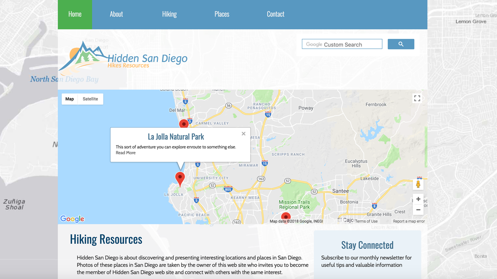
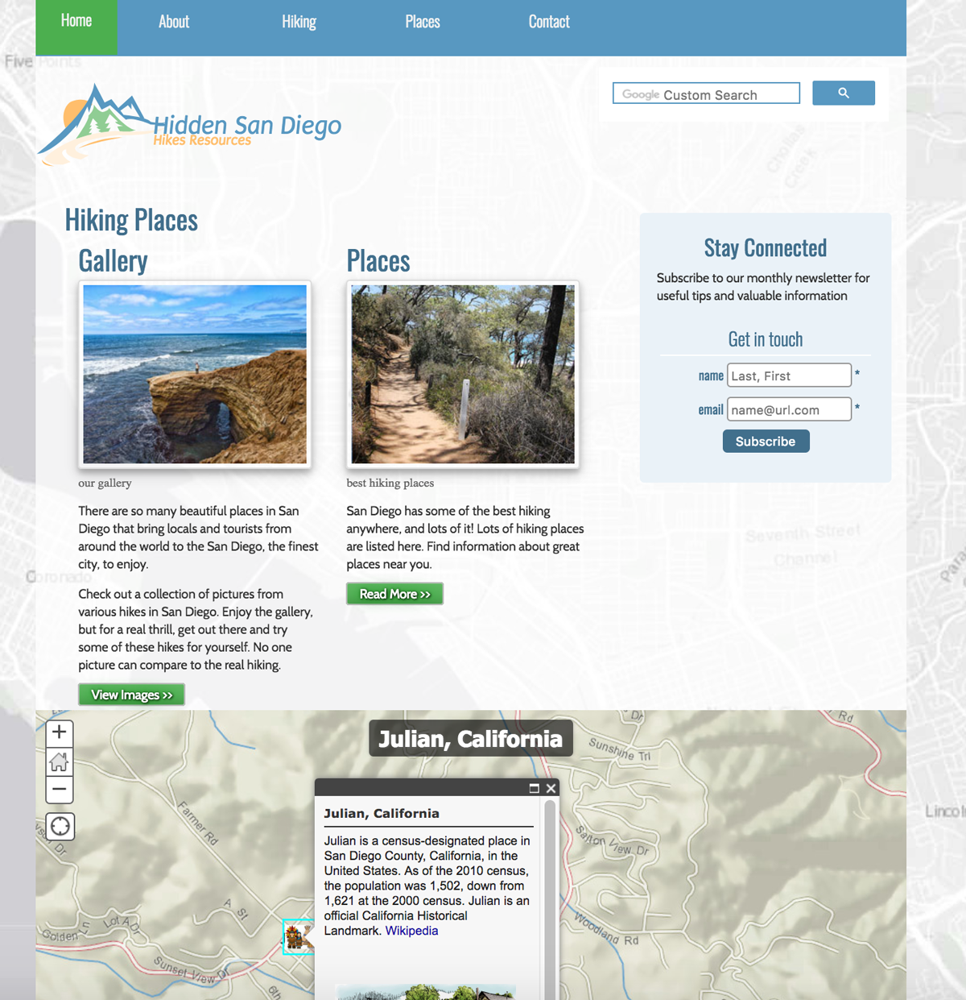

# JustHikes
JustHikes is a student project using ArcGIS tools, including ESRI's StoryMap Applications, and google API's.

> As a student project I redesigned hiddensandiego website.  I modernized the brand’s website and improved  website’s usability, navigation, and design.  Some maps were created using ArcGIS tools, including ESRI's StoryMap Applications.

#### This project is published at: [IrinaSerova.github](https://irinaserova.github.io/JustHikes/index.html)

#### The part of the project is published at: [maps.arcgis.com](https://iserova.maps.arcgis.com/apps/MapSeries/index.html?appid=6299c6bec2b94ec68c1d269446428507)

